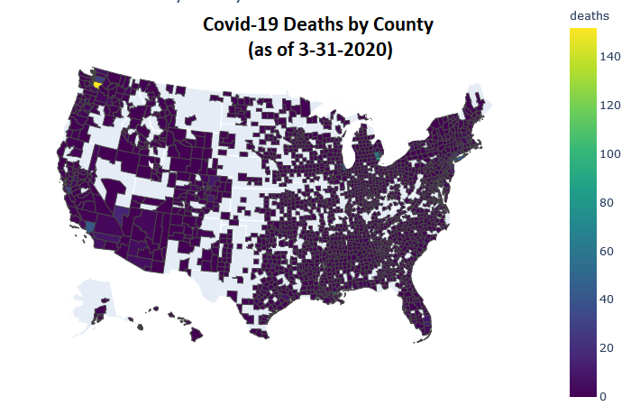

# What (possible) health factors play into Covid-19 deaths?

(View the complete notebook [here](https://nbviewer.jupyter.org/github/tjbanks/udacity_covid/blob/master/Covid_Udacity.ipynb))

In this project we'll be looking at how the following factors may play into the number of deaths related to Covid-19.

* HIV-AIDS & tuberculosis
* Diarrhea, lower respiratory
* Neglected tropical diseases
* Maternal disorders
* Neonatal disorders
* Nutritional deficiencies
* Other communicable, maternal, neonatal, and nutritional diseases
* Neoplasms
* Cardiovascular diseases
* Chronic respiratory diseases
* Cirrhosis and other chronic liver diseases
* Digestive diseases
* Neurological disorders
* Mental and substance use disorders
* Diabetes, urogenital, blood, and endocrine diseases
* Musculoskeletal disorders
* Other non-communicable diseases
* Transport injuries
* Unintentional injuries
* Self-harm and interpersonal violence
* Forces of nature, war, and legal intervention

## Analysis 

We used several methods to evaluate the datasets and compare mortality rates to COVID-19 deaths. 
* Choropleths
* Descriptive analysis and percentiles
* Correlation heatmaps
* Linear Regression for predicting deaths

## Results

At this point there is little correlation between mortality rates in a particular location and the number of COVID-19 deaths. This may change as death rates increase.

## Libraries Used

* Jupyter
* numpy
* pandas
* matplotlib
* sklearn
* seaborn
* plotly

## Description of Files

`Covid_Udacity.ipynb` - Main jupyter notebook

`us-counties.csv` - Covid-19 cases and deaths by county dataset

`mort.csv` - Mortality rates for 2014 dataset 

`co-est2019-alldata-1.csv` - unused population estimates dataset

`geojson-counties-fips.json` - used for plotting counties on a map in the ipynb

`*.png` - various visuals

## Acknowledgements

Datasets were collected from
https://www.kaggle.com/fireballbyedimyrnmom/us-counties-covid-19-dataset
https://www.kaggle.com/IHME/us-countylevel-mortality/data
https://www2.census.gov/programs-surveys/popest/datasets/2010-2019/counties/totals/
